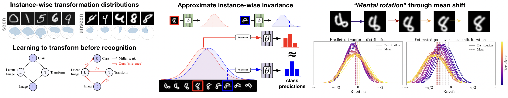

# Learning to Transform for Generalizable Instance-wise Invariance
Official public repo for the ICCV'23 paper "Learning to Transform for Generalizable Instance-wise Invariance"



**Project website:** https://sutkarsh.github.io/projects/learned_invariance

**ArXiv paper:** https://arxiv.org/abs/2309.16672

To replicate CIFAR-10 experiments, please run ```scripts/lila_experiments.sh```. The codebase for LILA experiments is largely based off [LILA](https://github.com/tychovdo/lila/), and we highly recommend citing the original work.

All other experiment scripts can be found in ```scripts/```, and once they have been run, their plots can be created in ```plots.ipynb```.

Alignment code can be found in ```alignment.ipynb```


Checkpoints for experiments/plots:
- For the rotgen experiments, please first download the classifier [here](https://drive.google.com/file/d/1iNTzUm0U2n4cq-axPuzt3rXnC-SXISU_/view?usp=sharing)
- The width plot in plots.ipynb uses the file [augerino_mario_90.npy](https://drive.google.com/file/d/1t3WHQVOj2B_Ct7D0bsMT8LBVVWxKPg9L/view?usp=sharing)


To cite our paper, please use the following bibtex

```
@InProceedings{Singhal_2023_flowinv_ICCV,
  author    = {Singhal, Utkarsh and Esteves, Carlos and Makadia, Ameesh and Yu, Stella X.},
  title     = {Learning to Transform for Generalizable Instance-wise Invariance},
  booktitle = {Proceedings of the IEEE/CVF International Conference on Computer Vision (ICCV)},
  month     = {October},
  year      = {2023},
  pages     = {6211-6221}
}
```
